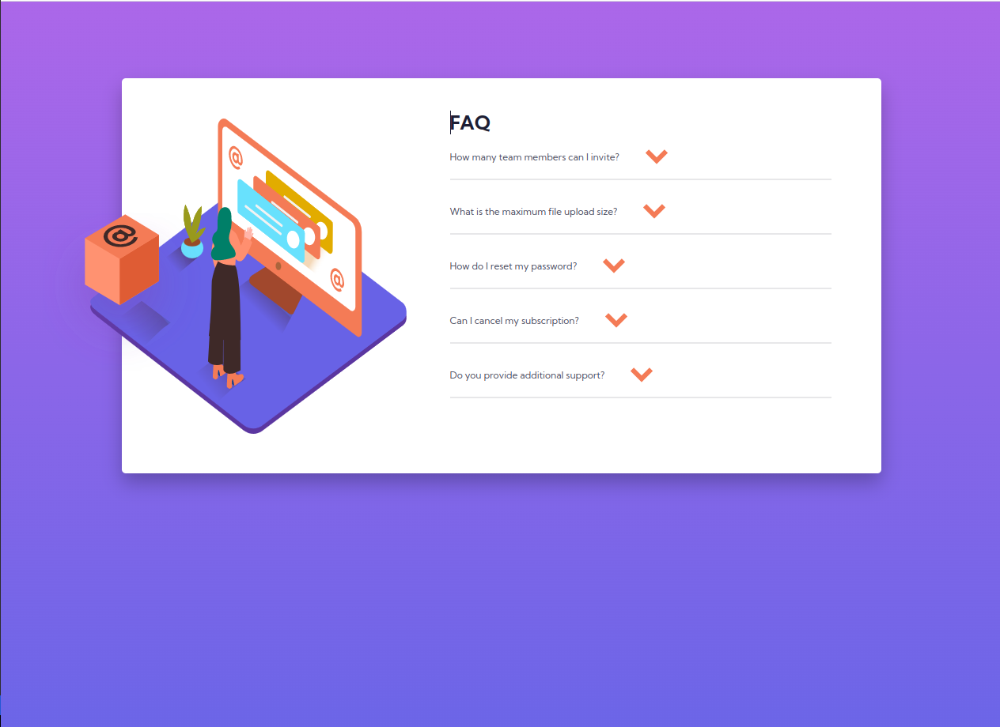

# Frontend Mentor - FAQ accordion card solution

This is a solution to the [FAQ accordion card challenge on Frontend Mentor](https://www.frontendmentor.io/challenges/faq-accordion-card-XlyjD0Oam). Frontend Mentor challenges help you improve your coding skills by building realistic projects. 

## Table of contents

- [Overview](#overview)
  - [The challenge](#the-challenge)
  - [Screenshot](#screenshot)
  - [Links](#links)
- [My process](#my-process)
  - [Built with](#built-with)
  - [What I learned](#what-i-learned)
  - [Continued development](#continued-development)
  - [Useful resources](#useful-resources)
- [Author](#author)


**Note: Delete this note and update the table of contents based on what sections you keep.**

## Overview

### The challenge

Users should be able to:

- View the optimal layout for the component depending on their device's screen size
- See hover states for all interactive elements on the page
- Hide/Show the answer to a question when the question is clicked

### Screenshot



Add a screenshot of your solution. The easiest way to do this is to use Firefox to view your project, right-click the page and select "Take a Screenshot". You can choose either a full-height screenshot or a cropped one based on how long the page is. If it's very long, it might be best to crop it.

Alternatively, you can use a tool like [FireShot](https://getfireshot.com/) to take the screenshot. FireShot has a free option, so you don't need to purchase it. 

Then crop/optimize/edit your image however you like, add it to your project, and update the file path in the image above.

**Note: Delete this note and the paragraphs above when you add your screenshot. If you prefer not to add a screenshot, feel free to remove this entire section.**

### Links

- Live Site URL: [Add live site URL here](https://frontendmentor-faqaccordion.netlify.app/)

## My process

### Built with

- Semantic HTML5 markup
- CSS custom properties
- Flexbox
- CSS Grid
- Mobile-first workflow


### What I learned

I learned absolute positioning
Enhanced grid and flexbox skills
active state with CSS and more

To see how you can add code snippets, see below:

```html
<h1>Some HTML code I'm proud of</h1>
```
```css
.accordion {
    max-width: 960px;
    border-radius: 5px;
    margin: 150px auto;
    background: #fff;
    padding: 25px 48px 80px 400px; 
    box-shadow: 0 12px 24px rgba(0, 0, 0, 0.25);
    display: flex;
    flex-direction: column;
    position:relative;
}
.item > h1 {
    grid-column: 1 / span 3;
    text-transform: uppercase;
    font-weight: 700;
    color:var(--very--dark);
}

.text:hover ~ .hidden-box {
    display: block;
}
 .illustration {
    position:absolute;
    height: 400px;
    width: 400px;
    left: 0;
    top: 50%;
    transform: translate(-10%, -50%);

}

 .illustration-box {
    position: absolute;
    height: 200px;
    width: 200px;
    left:0;
    top:50%;
    transform: translate(-50%, -40%);

}
```
```js
const proudOfThisFunc = () => {
  console.log('🎉')
}
```


## Author

- Twitter - [@yourusername](https://www.twitter.com/hakifred201)

